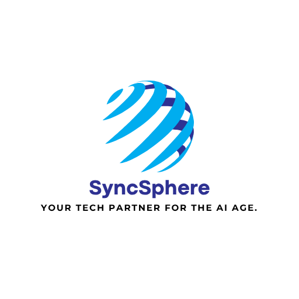

# SyncSphere AI Agency

<div align="center">
  
  
  **Global AI Solutions Provider**
  
  *Transforming businesses through intelligent automation and AI-powered solutions*

  [](https://syncsphere.ai)
  [](https://wa.me/447424819094)
  [](mailto:hello@syncsphere.ai)
</div>

## 🚀 About SyncSphere

SyncSphere is a cutting-edge AI agency specializing in intelligent automation, custom AI solutions, and business transformation. We help companies worldwide leverage artificial intelligence to streamline operations, enhance customer experiences, and drive growth.

### 🎯 Our Mission
To democratize AI technology and make intelligent automation accessible to businesses of all sizes, from startups to enterprises.

## ✨ Key Features

### 🤖 AI-Powered Assistant
- **Multi-Tab Interface**: General, Startup, Technical, and Market Intelligence tabs
- **Human-Like Engagement**: Psychological triggers for natural conversations
- **Session Management**: Persistent chat history and context awareness
- **Smart Escalation**: Automatic handoff to human experts when needed
- **Document Analysis**: Upload and analyze business documents
- **Voice-to-Text**: Audio message processing capabilities
- **Web Scraping**: Real-time website analysis and data extraction
- **Market Intelligence**: Live competitor analysis and market insights

### 💰 Flexible Pricing System
- **Modular Approach**: Pay-per-feature pricing model
- **Pilot Programs**: £1,500 starter packages with upgrade credits
- **Multi-Currency**: GBP, USD, EUR support with live exchange rates
- **ROI Calculator**: Interactive return on investment analysis
- **WhatsApp Integration**: Direct consultation booking

### 📊 Business Intelligence
- **Document Generation**: Automated business plans, budgets, proposals
- **Market Research**: Real-time industry analysis and trends
- **Competitive Analysis**: Comprehensive competitor intelligence
- **Financial Projections**: AI-powered revenue forecasting
- **Startup Validation**: Framework-based business model validation

### 🔧 Technical Capabilities
- **Web Scraping API**: Puppeteer-based content extraction
- **Search Integration**: DuckDuckGo-powered real-time search
- **Contact Management**: Serverless email routing with Resend
- **Personalization Engine**: Location-based content adaptation
- **Behavioral Triggers**: Smart engagement based on user patterns

## 🛠️ Technology Stack

### Frontend
- **React 18** with TypeScript
- **Vite** for fast development and building
- **Tailwind CSS** for responsive styling
- **shadcn/ui** for modern UI components
- **Lucide React** for consistent iconography
- **React Router** for client-side routing

### Backend & APIs
- **Vercel Serverless Functions** for API endpoints
- **Puppeteer** for web scraping capabilities
- **Resend** for professional email delivery
- **OpenRouter** for AI model integration
- **DuckDuckGo API** for web search functionality

### Development Tools
- **ESLint** for code quality
- **TypeScript** for type safety
- **PostCSS** for CSS processing
- **React Hook Form** for form management
- **Zod** for schema validation

## 📁 Project Structure

```
syncsphere-ai-agency/
├── api/                    # Serverless API functions
│   ├── contact.js         # Contact form handler
│   ├── web-scrape.js      # Website scraping service
│   ├── web-search.js      # Real-time search API
│   ├── analyze-document.js # Document analysis
│   ├── voice-to-text.js   # Audio transcription
│   └── generate-document.js # Business document generation
├── src/
│   ├── components/        # React components
│   │   ├── ui/           # shadcn/ui components
│   │   ├── OpenRouterChat.tsx # AI assistant
│   │   ├── ContactFormNew.tsx # Contact forms
│   │   ├── ROICalculator.tsx  # ROI analysis tool
│   │   └── ...
│   ├── pages/            # Route components
│   ├── hooks/            # Custom React hooks
│   ├── lib/              # Utility functions
│   └── styles/           # CSS and styling
├── public/               # Static assets
└── ...
```

## 🚀 Quick Start

### Prerequisites
- Node.js 18+ or Bun
- Git

### Installation

1. **Clone the repository**
   ```bash
   git clone https://github.com/syncsphere/syncsphere-ai-agency.git
   cd syncsphere-ai-agency
   ```

2. **Install dependencies**
   ```bash
   npm install
   # or
   bun install
   ```

3. **Environment setup**
   ```bash
   cp .env.example .env.local
   ```
   
   Configure your environment variables:
   ```env
   VITE_OPENROUTER_API_KEY=your_openrouter_key
   RESEND_API_KEY=your_resend_key
   ```

4. **Start development server**
   ```bash
   npm run dev
   # or
   bun dev
   ```

5. **Open your browser**
   Navigate to `http://localhost:5173`

### Deployment

**Vercel (Recommended)**
```bash
npm run build
vercel --prod
```

**Manual Build**
```bash
npm run build
# Deploy the dist/ folder to your hosting provider
```

## 🔌 API Endpoints

### Contact Management
- `POST /api/contact` - Handle contact form submissions
- Integrates with Resend for email delivery
- Smart routing based on inquiry type

### AI Services
- `POST /api/web-scrape` - Extract website content and metadata
- `POST /api/web-search` - Real-time web search functionality
- `POST /api/analyze-document` - Process uploaded business documents
- `POST /api/voice-to-text` - Convert audio to text transcription

### Document Generation
- `POST /api/generate-document` - Create business documents
- Supports: Business plans, budgets, proposals, pitch decks
- AI-powered content generation with industry-specific templates

## 🎨 Features Showcase

### AI Assistant Capabilities
- **Startup Validation**: Framework-based business model analysis
- **Technical Consulting**: Architecture recommendations and code review
- **Market Intelligence**: Real-time competitor and industry analysis
- **Document Processing**: Upload and analyze business documents
- **Voice Integration**: Audio message processing and transcription

### Business Tools
- **ROI Calculator**: Interactive return on investment analysis
- **Pricing Configurator**: Dynamic pricing with multi-currency support
- **Contact Management**: Professional inquiry handling and routing
- **Document Generator**: Automated business document creation

### User Experience
- **Responsive Design**: Mobile-first approach with cross-device compatibility
- **Dark/Light Themes**: Automatic theme detection and manual toggle
- **Progressive Enhancement**: Works without JavaScript for core functionality
- **Accessibility**: WCAG 2.1 compliant with keyboard navigation support

## 📞 Contact & Support

### Global Offices
- **UK**: +44 742 481 9094 (WhatsApp Available)
- **US**: +1 815 472 7760
- **Netherlands**: +31 97010257248

### Digital Channels
- **Email**: hello@syncsphere.ai
- **Website**: [syncsphere.ai](https://syncsphere.ai)
- **WhatsApp**: [Direct Chat](https://wa.me/447424819094)

### Business Hours
- **UK/EU**: Monday-Friday, 9:00-18:00 GMT
- **US**: Monday-Friday, 9:00-17:00 EST
- **Emergency Support**: 24/7 via WhatsApp

## 🤝 Contributing

We welcome contributions from the developer community! Please read our contributing guidelines before submitting pull requests.

### Development Workflow
1. Fork the repository
2. Create a feature branch
3. Make your changes
4. Test thoroughly
5. Submit a pull request

### Code Standards
- TypeScript for type safety
- ESLint for code quality
- Prettier for formatting
- Conventional commits for git history

## 📄 License

This project is proprietary software owned by SyncSphere AI Agency. All rights reserved.

For licensing inquiries, please contact: legal@syncsphere.ai

## 🌟 Why Choose SyncSphere?

- **Proven Expertise**: Successfully delivered 100+ AI automation projects
- **Global Reach**: Serving clients across UK, US, EU, and beyond
- **Flexible Pricing**: Pay-per-feature model with no long-term commitments
- **24/7 Support**: Round-the-clock assistance via WhatsApp
- **Cutting-Edge Tech**: Latest AI models and automation frameworks
- **Business Focus**: ROI-driven solutions that deliver measurable results

---

<div align="center">
  <strong>Ready to transform your business with AI?</strong>
  
  [Start Your Pilot Program](https://wa.me/447424819094) | [View Live Demo](https://syncsphere.ai) | [Get Quote](mailto:hello@syncsphere.ai)
</div>